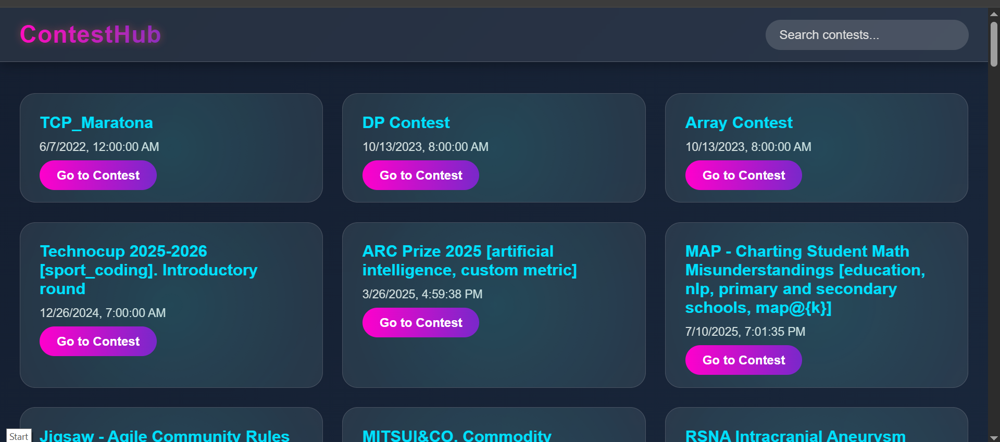
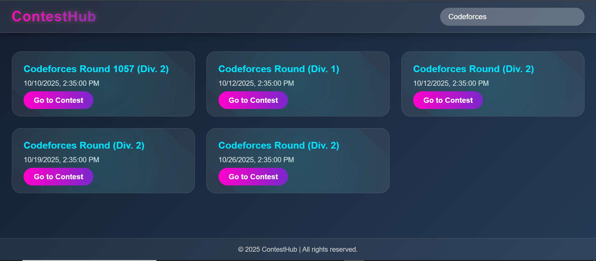

# 🚀 ContestHub — Upcoming Coding Contests Tracker

**ContestHub** is a modern, responsive web app that lists upcoming programming contests (Codeforces, LeetCode, AtCoder, CodeChef, etc.) in a clean card UI.  
It demonstrates API integration, client/server code, responsive UI, and small production considerations — a compact, resume-ready full-stack project.

---

## 🔎 Project Summary

- **Purpose:** Aggregate and display upcoming coding contests from multiple sources so competitive programmers can quickly see what's next.
- **Frontend:** HTML, CSS (modern theme), JavaScript (fetch + DOM manipulation).
- **Backend (optional / recommended):** Node.js + Express — used to proxy and merge contest APIs (recommended when using private API keys like Clist.by).
- **APIs used:** Clist.by (recommended for reliable coverage, **requires API key**), `kontests.net` (public-ish endpoints for some platforms), Codeforces official API.
- **Showcase options:** Local demo, recorded video, or static frontend deploy (Hugging Face Spaces / GitHub Pages) using public APIs.

---
## Demo Vedio
[](https://drive.google.com/file/d/1-YY7nKZnHcdKcEzoM9MWZHlee8l64zBU/view)

---

## ✨ Features

- Fetches and aggregates upcoming contests from multiple platforms
- Responsive **card grid** UI (modern theme)
- **Search** to filter contests by name
- English-only filtering (removes non-English contest names)
- Easy to run locally (full stack) or deploy frontend-only

---

## 📁 Project Structure

```bash
contesthub/
│
├── frontend/
│   ├── index.html
│   ├── style.css
│   └── script.js
│
├── server.js
├── package.json
└── README.md
```

---

## ▶️ How to Run (Recommended: Backend + Frontend)

This runs the Node.js backend that talks to Clist.by (securely using your API key) and serves the frontend.

### 1. Prerequisites

- Node.js >= 14 (LTS recommended)
- npm

### 2. Clone repo

```bash
git clone https://github.com/<your-username>/contesthub.git
cd contesthub
```
###  3. Install dependencies
```bash
npm install
# (this installs express, axios, cors; optionally dotenv if you add it)
```
### 4. Add Clist.by credentials (secure)
```bash
CLIST_USERNAME=your_clist_username
CLIST_API_KEY=your_clist_api_key
```
Get credentials from https://clist.by/settings/api/

Important: Never commit .env or your API key to a public repo.

If you use the provided server.js that reads process.env, install dotenv and add require('dotenv').config() at the top of server.js:
```bash
npm install dotenv

```
### 5. Start server
```bash
node server.js
```
You should See
```bash
Server running on http://localhost:3000

```
### 6. Open the Frontend
Open in Brower
```bash
http://localhost:3000/index.html

```
---
## 🧩 Tech Stack
- Frontend: HTML, CSS, JavaScript
- Backend: Node.js + Express
- API: Clist.by (for contest data)

---
## 🔑 API Setup (Clist.by)
1. Go to https://clist.by/api/v4/doc/
2. Create an account and get your username and API key
3. Update your credentials in server.js:
   ```bash
   const CLIST_USERNAME = 'your_username';
   const CLIST_API_KEY = 'your_api_key';
   ```
   ---
## 🧭 How It Works
1. The backend (server.js) calls the Clist.by API to get all upcoming contests.
2. The frontend (index.html + script.js) fetches that data and displays it beautifully in cards.
3. Users can search contests in real-time by name or date.
   
   ---
   
## 📸 Demo Screenshot
### Homepage


### Search Feature



---

 ## 🤝 Contributing
   - Feel free to fork this repo and submit pull requests to improve UI, add new contest filters, or integrate user authentication.
   
---

## 📜 License
   - This project is licensed under the MIT License.
   
---

## 👨‍💻 Author

**Omkar Ch.**  
💼 Machine Learning Enthusiast | Aspiring Software Engineer  
🌐 [Portfolio Website](https://omkar-ai-vision.lovable.app/)  
📧 [Email](mailto:chomkar1872@gmail.com)  
🔗 [LinkedIn](https://www.linkedin.com/in/omkar1872/)  
💻 [GitHub](https://github.com/omkar1872)

---

⭐ **If you found this useful, please give it a star on GitHub!** ⭐  
It motivates me to keep building awesome open-source projects.


  
